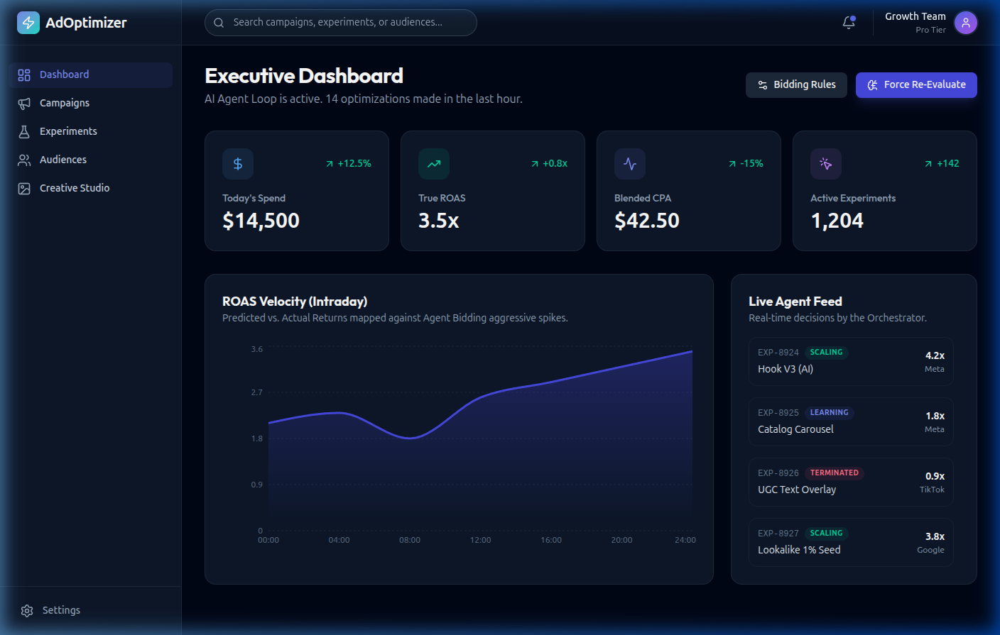
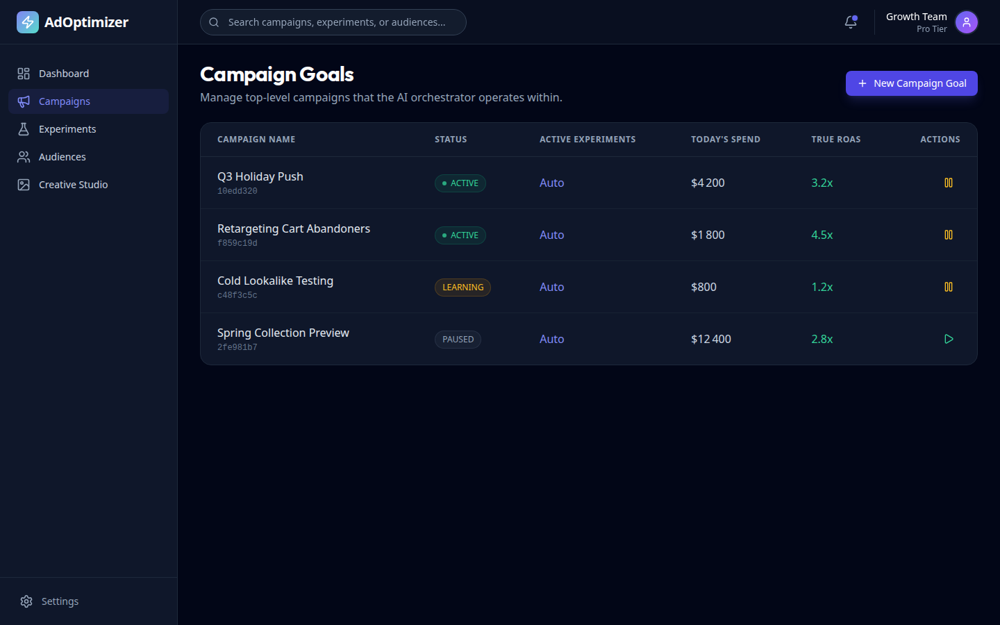
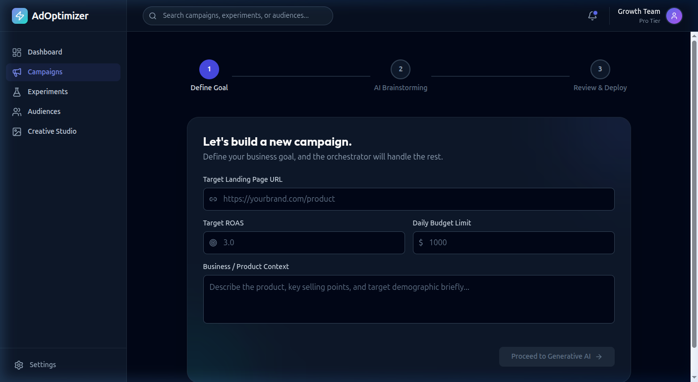
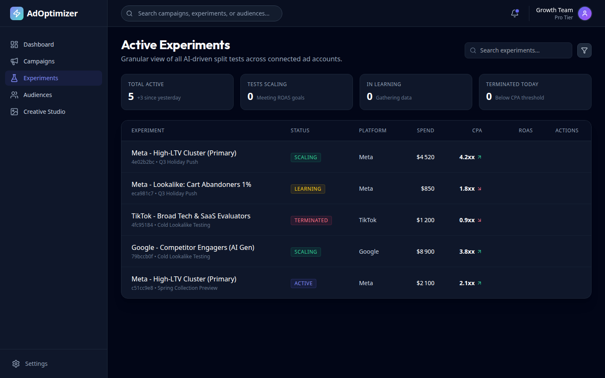
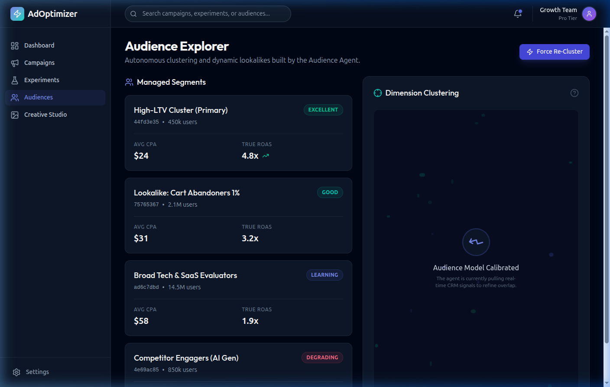
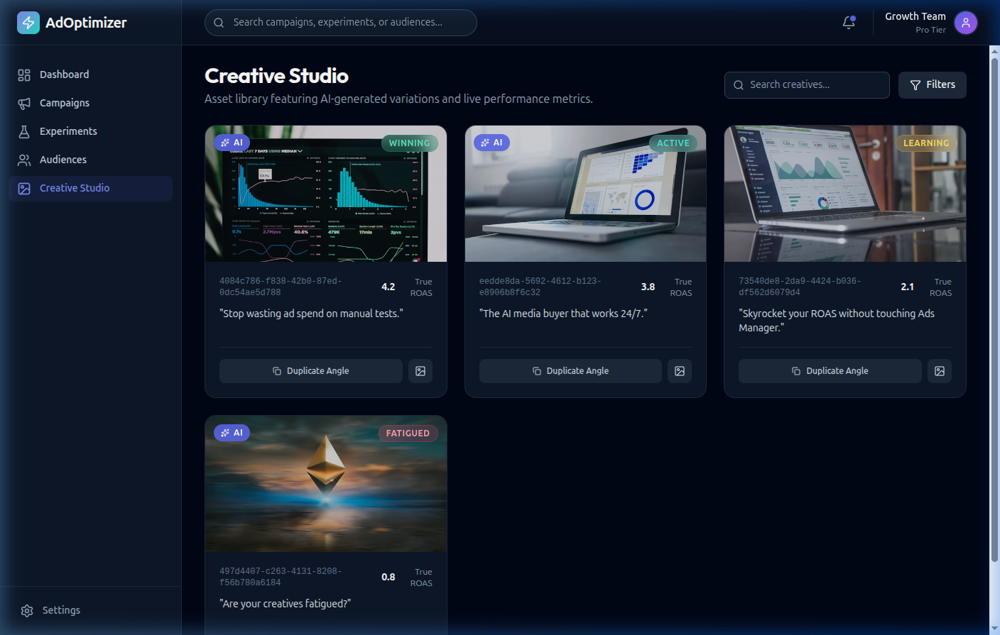
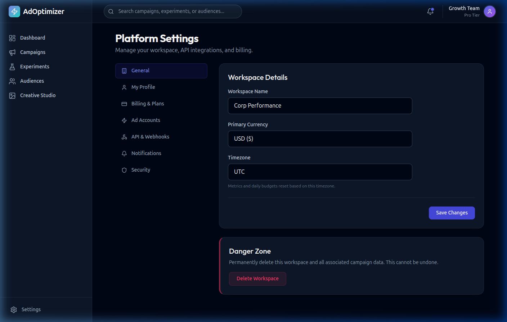

<div align="center">


</div>

<br/>

<div align="center">
  <h1>⚡ AdOptimizer</h1>
  <p><strong>AI-Powered Ad Campaign Orchestration Platform</strong></p>
  <p>Autonomously generate, test, and optimize advertising creatives powered by local AI (Ollama) and a multi-agent orchestration loop.</p>
</div>

---


### 📊 Executive Dashboard


### 🎯 Campaign Goals


### 🤖 AI Campaign Wizard


### 🧪 Active Experiments


### 👥 Audience Intelligence


### 🎨 Creative Studio


### ⚙️ Platform Settings


---

## ✨ Features

| Feature | Description |
|---|---|
| 🤖 **Ollama AI Integration** | Local LLM generation via Ollama (llama3, mistral, etc.) — no API keys needed |
| 🎯 **Campaign Orchestrator** | Multi-step AI wizard that generates ad creatives, audiences, and campaign goals |
| 🧪 **A/B Experiment Engine** | Granular split-test management across Meta, Google, and TikTok ad accounts |
| 👥 **Audience Intelligence** | AI-driven audience clustering and lookalike discovery |
| 🎨 **Creative Studio** | AI-generated ad creatives with persistent database storage |
| 📊 **Executive Dashboard** | Real-time ROAS velocity charts and live agent decision feed |
| ⚙️ **Persistent Settings** | Workspace name, timezone, currency, and user profile — all saved to the database |
| 🔒 **Secure by Design** | Helmet.js, CORS middleware, and environment-based config |

---

## 🏗️ Project Structure

```
AdOptimizer/
├── web/                    # ⚡ Next.js 16 Frontend (Turbopack)
│   ├── src/app/            # App Router pages
│   └── next.config.ts      # API proxy rewrites → localhost:8080
├── api/                    # 🚀 Node.js + Express Backend
│   ├── src/
│   │   ├── controllers/    # API route handlers
│   │   ├── services/       # OllamaAgent, CreativeAgent
│   │   └── index.ts        # Express server entry
│   └── prisma/             # SQLite schema & migrations
├── docs/                   # 📚 Documentation & assets
│   └── assets/             # App screenshots
└── README.md
```

---

## 🚀 Getting Started

### Prerequisites

- **Node.js** v18+
- **pnpm** (recommended) or npm
- **Ollama** running locally with at least one model pulled

```bash
# Install Ollama and pull a model
ollama pull llama3
```

### Installation

```bash
# 1. Clone the repository
git clone https://github.com/the-shadow-0/AdOptimizer.git
cd AdOptimizer

# 2. Install API dependencies
cd api && pnpm install

# 3. Set up the database
pnpm exec prisma db push
npx ts-node prisma/seed.ts

# 4. Install Web dependencies
cd ../web && pnpm install
```

### Running the Application

Open **two terminals**:

```bash
# Terminal 1 — Start the API backend (port 8080)
cd api && pnpm run dev

# Terminal 2 — Start the Next.js frontend (port 3000)
cd web && pnpm run dev
```

Open [http://localhost:3000](http://localhost:3000) 🎉

---

## 🤖 AI Campaign Generation

1. Navigate to **Campaigns → New Campaign Goal**
2. Fill in your landing page URL, target ROAS, daily budget, and business context
3. Click **"Proceed to Generative AI"** then **"Start Generation"**
4. The Ollama agent will generate:
   - 🎨 **3 unique ad creative variants** with headlines and copy
   - 👥 **3 audience segments** for targeting
   - 📋 **1 campaign goal** record saved to the database
5. Generated creatives appear in **Creative Studio** immediately

> **💡 Note:** Make sure Ollama is running (`ollama serve`) and a model is available before starting generation. The system will use the best available model automatically.

---

## 🔧 Tech Stack

### Frontend
- **Next.js 16** with Turbopack
- **TypeScript** — full type safety
- **Tailwind CSS** — utility-first styling
- **Framer Motion** — smooth page animations
- **Recharts** — data visualizations
- **React Hot Toast** — elegant notifications

### Backend
- **Express.js** — REST API server
- **Prisma ORM** — type-safe database access
- **SQLite** (via `@prisma/adapter-better-sqlite3`) — lightweight, zero-config database
- **Ollama HTTP API** — local AI model inference

### AI Layer
- **OllamaAgent** — Auto-detects best available local model (`llama3`, `mistral`, `phi3`, `gemma2`, etc.)
- **Graceful fallback** — App stays functional even when Ollama is offline

---

## 🗺️ API Endpoints

| Method | Endpoint | Description |
|--------|----------|-------------|
| `GET` | `/api/v1/workspace` | Get workspace info |
| `PUT` | `/api/v1/workspace/settings` | Update workspace name, timezone, currency |
| `GET` | `/api/v1/user` | Get current user profile |
| `PUT` | `/api/v1/user` | Update name, email, avatar initials |
| `GET` | `/api/v1/campaigns` | List campaign goals |
| `POST` | `/api/v1/campaigns/orchestrate` | Launch AI orchestration job |
| `GET` | `/api/v1/campaigns/orchestrate/:jobId` | Poll job status |
| `GET` | `/api/v1/experiments` | List A/B experiments |
| `GET` | `/api/v1/audiences` | List audience segments |
| `GET` | `/api/v1/creatives` | List generated creatives |

---

## 📄 License

This project is licensed under the **MIT License** — see the [LICENSE](LICENSE) file for details.

```
MIT License © 2026 the-shadow-0
```

---

<div align="center">
  <p>Built with ❤️ by <a href="https://github.com/the-shadow-0">the-shadow-0</a></p>
  <p>⭐ Star this repo if you find it useful!</p>
</div>
