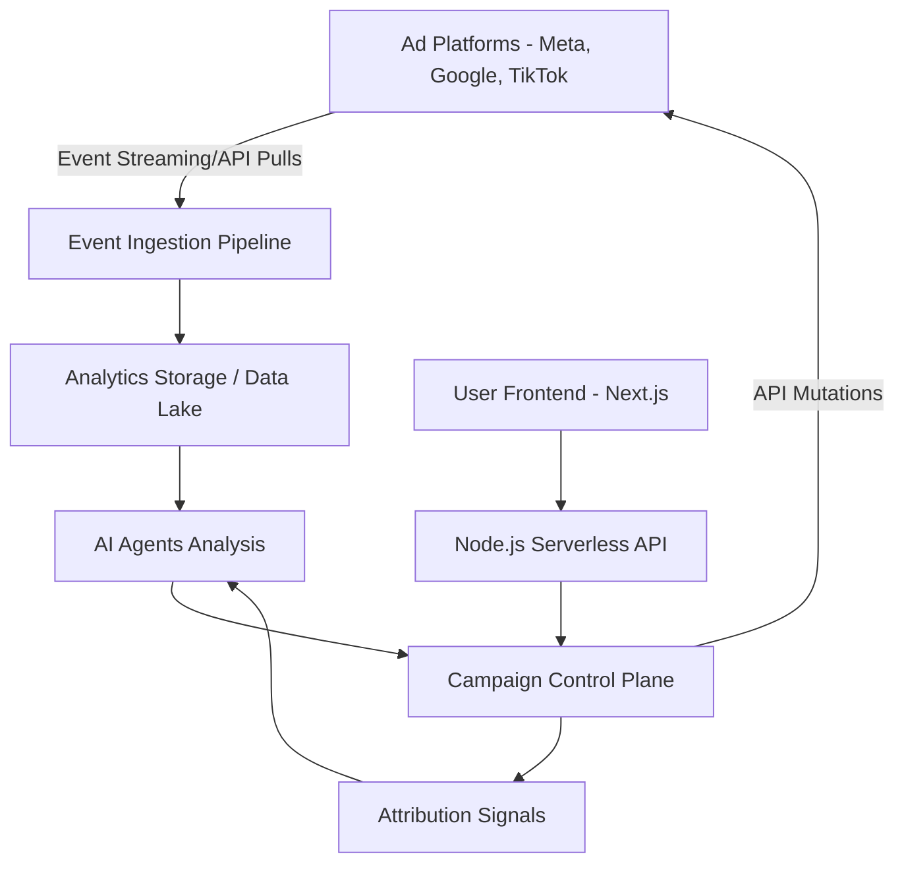

# System Architecture

AdOptimizer is designed for high-availability and extreme scale. The architecture entirely eliminates Docker in favor of managed serverless environments and dedicated compute boundaries.

## Overall Architecture Stack
- **Frontend Layer:** Next.js deployed on Vercel. Connects securely to the Node.js API layer.
- **Backend API Layer:** Node.js API services deployed using Serverless Cloud Functions (e.g., AWS Lambda or Google Cloud Functions).
- **AI Agent Layer:** Antigravity orchestrates task execution. Local models (Ollama) run on GPU-enabled compute instances for parallel execution of generative tasks, while deep reasoning runs via Gemini/OpenAI APIs.
- **Data & Event Layer:** Streaming ingestion pipeline (e.g., Apache Kafka or AWS Kinesis), populating a cloud data lake (e.g., BigQuery or Snowflake). User event states are stored in high-performance transactional databases (e.g., PostgreSQL).
- **Creative Storage:** Cloudinary via CDN for dynamic asset distribution and transformations.

## Data Flow Design

1. **Ad Platform Metrics:** Raw metrics (clicks, impressions, spend) stream into the event pipeline.
2. **Analytics Storage:** Data is normalized and aggregated.
3. **Agent Analysis:** AI agents query the data layer to detect performance decay or optimization opportunities.
4. **Campaign Control Plane:** Validates agent decisions and applies business rules.
5. **Mutations:** Instructions are sent back to the Ad Platforms via APIs.
6. **Attribution Signals:** Webhooks from GA4 and attribution partners close the loop, computing true ROAS.

## Deployment Architecture

### 1. Frontend 
- Next.js Edge execution.
- Vercel for instant CDN invalidation, preview branches, and high uptime.

### 2. Backend API Services
- Node.js functions structured via Serverless framework.
- Stateless design enabling auto-scaling from zero to millions of invocations.

### 3. AI Agent Infrastructure
- **Agent Orchestrator:** lightweight runtime deployed as background workers (e.g., BullMQ on standard compute nodes).
- **Model Inference:** Dedicated GPU nodes (e.g., AWS EC2 G5 series) running Ollama instances exposed securely via internal networking to the Orchestrator. No containers; natively installed binaries managed by systemd.

## Scalability Strategy

To handle thousands of ad accounts and millions of events per day without Dockerized orchestration (like Kubernetes):
- **Event Queues:** Use partitioned publish-subscribe streams for all inbound traffic to prevent API dropouts.
- **Parallel Processing:** Background jobs distributed via Redis queues allow parallel experiment deployment.
- **Batched Model Inference:** Creative generation requests are batched and scheduled on GPU instances to maintain high throughput.
- **API Rate Management:** A distributed rate-limiter protects against Ad Platform API limits, retrying gracefully with exponential backoff.
